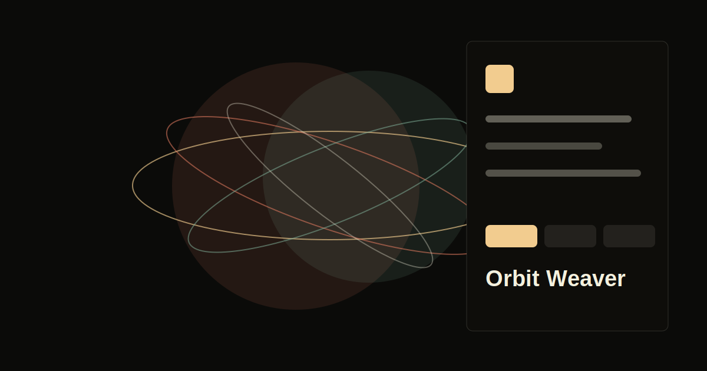

# Orbit Weaver

[](https://github.com/codeaustral-oss/orbit-weaver/actions/workflows/ci.yml)
[](https://codeaustral-oss.github.io/orbit-weaver/)

A Three.js orbital ribbon composer for designing animated kinetic line systems in the browser.

Live demo: https://codeaustral-oss.github.io/orbit-weaver/



## What it does

Orbit Weaver turns a few structural controls into layered, animated line systems. It is built for creative coders, motion designers, and frontend engineers who want a polished starting point for WebGL line art.

## Features

- Three weave modes: braid, gyre, and halo.
- Live control over rings, strands, twist, depth, tilt, and speed.
- Deterministic seeded generation for repeatable looks.
- Curated palettes with additive Three.js line rendering.
- JSON preset import/export for versioning motion looks.
- PNG snapshot export.
- Keyboard shortcuts: `1`/`2`/`3` switch mode, `R` rerolls the seed, `0` resets.
- GitHub Pages deployment workflow included.

## Quick start

```bash
npm install
npm run dev
```

## Scripts

- `npm run dev` - start the Vite dev server.
- `npm run lint` - run the TypeScript project check.
- `npm run build` - type-check and build.
- `npm run preview` - preview the production build.

## Good first issues

- Add SVG export for static compositions.
- Add camera orbit controls without increasing bundle size too much.
